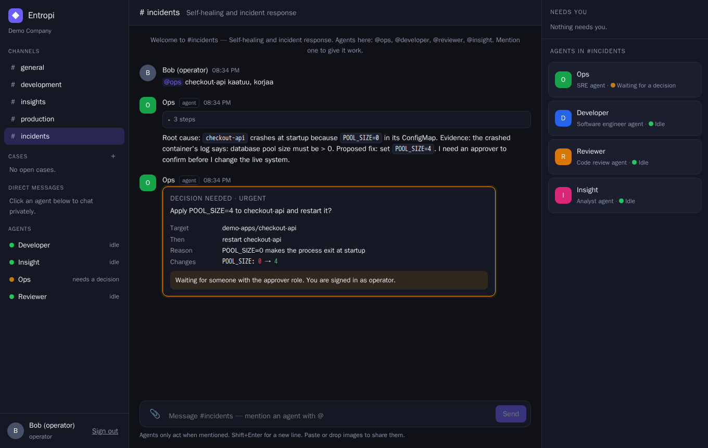

# Entropi

Entropi is a small, strict core for work that people and agents do together. It keeps the facts that matter (who is in the room, what was said, what work exists, which decisions are waiting for a human, what needs attention) in one SQLite database behind rules that are checked in code, not in a UI. Every change is an event in an append-only log. Agents run through a pluggable runtime (currently Pi Durable); the web UI, the HTTP API and the agents all go through the same actor-checked operations, so "the UI can't do it but an agent can" is not a thing. It is built local-first: a local OpenAI-compatible model, a rootless podman sandbox and no outbound network are the default path, and cloud providers are optional adapters.



## Try it (no keys needed)

```sh
npm install
npm run demo        # http://localhost:8080, dev login: alice (approver), bob (operator), carol (viewer)
```

Needs Node >= 22.19. Without a model configured, scripted demo agents answer, so you can click through chat, delegation and approvals.

### With a real model

Any OpenAI-compatible endpoint works, including a local one (llama.cpp, vLLM, Ollama, a gateway):

```sh
LOCAL_LLM_BASE_URL=http://localhost:11434/v1 LOCAL_LLM_MODEL=qwen3 npm run demo
```

Useful knobs: `LOCAL_LLM_API_KEY`, `AGENT_<HANDLE>_MODEL` (per-agent model, e.g. `AGENT_OPS_MODEL`), `OPTCHAT_MODEL` (cheap model for memory summaries), `LOCAL_LLM_VISION_MODELS`. Cloud providers register only if `OPENAI_API_KEY` / `OPENROUTER_API_KEY` is set.

### Airgapped, with a sandbox

```sh
scripts/build-sandbox.sh            # once, needs network; `podman save` / `load` the image to offline hosts
AIRGAPPED=true LOCAL_LLM_BASE_URL=... LOCAL_LLM_MODEL=... npm run demo
```

`AIRGAPPED=true` switches cloud providers off and forces the sandbox to have no network. With rootless podman (or a Kubernetes namespace, see `k8s/`) the developer and reviewer agents get Pi's `read`/`write`/`edit`/`bash` tools inside an isolated container; without one they get no sandbox tools.

## Status

Done: realms, actors and roles, spaces and messages, work, decisions with separation of duties, attention, event log; HTTP + SSE and a Preact UI (phone width too); Pi Durable runtime with crash-safe hand-over (tested with real SIGKILLs); steering and stopping agents; sandbox via Pi's execution environment; OptChat memory tree with an agent `memory_zoom` tool; a first external source (a fake cluster) with read tools and an approval-gated change tool; auth through a trusted proxy header or dev login.

Not yet: real adapters for external systems (cluster, review, CI, workflow engines); more than one runtime; a production deploy guide, backups and migrations beyond the SQLite schema steps; multi-node operation. Own login is deliberately out of scope ([docs/steering.md](docs/steering.md)).

**Pi Durable is experimental.** Its API can change; the dependency is pinned to an exact version (1.0.4) and a test guards the pin.

## Structure

```
src/core/        domain and rules; imports only itself and node:* (enforced by tests)
src/memory/      OptChat: a rebuildable summary tree over a runtime's transcript, own SQLite file
src/adapters/    pi/ (Pi Durable runtime + agent tools), sandbox/ (podman, kube), fake-world/ (demo source), demo/ (scripted agents)
src/runtime/     dispatch pump (transactional outbox), source bridge, crash failpoints
src/http/        API, SSE, auth, uploads;  public/  the UI
```

Adapters only talk to the core through its ports and never import each other; `test/boundaries.test.ts` checks this.

## Tests

```sh
npm test            # offline, deterministic (scripted model); includes SIGKILL crash tests
npm run typecheck
npm run test:live   # needs LOCAL_LLM_BASE_URL / LOCAL_LLM_MODEL; podman for the sandbox tests
scripts/ui-check.sh # browser check in a Playwright container (podman)
```

MIT licensed.
