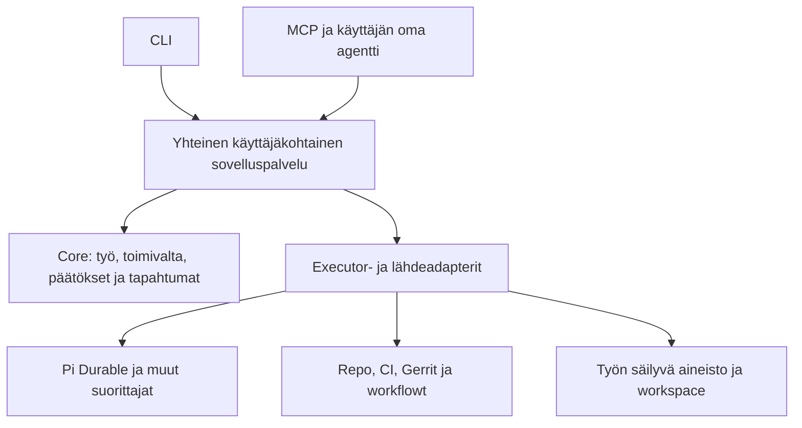

# Entropin puuttuvat yhteydet ja yhteensopivuus

Luettu 7.10.2026: Entropin commit `7503572` ja sen päällä muuttuva työpuu sekä Pi Durablen, Chordin, pi-serverin ja Pi Pocketin nykyiset verkkolähteet. Tämä on havaintomuistio ja oma arvio. Toteutusta ei muutettu eikä testejä ajettu. Ominaisuus- ja korjausväitteet perustuvat koodin lukemiseen.

## Mitä yhteensopivuus tarkoittaa tässä

Kolme käytännön tilannetta ovat: toinen käyttöpinta ohjaa samaa Entropia; toinen executor suorittaa samaa työtä; Pi-laajennuksesta käytetään jotain kyvykkyyttä. Näillä on eri liitoskohdat. Yhteinen Pi-riippuvuus ei yksin tee Pocketin käyttöliittymästä Entropin asiakasta tai CLI-extensionista Durable-extensionia.

Pi Pocketilla on oma `PocketApp`, HTTP-rajapinta, henkilöt, Durable-dokumentit ja käyttöliittymän tila. Näkymän liittäminen Entropiin vaatii sovittamista sen API:n ja näkymien välillä. [Pocketin projektikartta](https://github.com/TannerMidd/pi-pocket/blob/main/docs/map.md).

## Perusta, joka on jo oikeassa paikassa

- Core omistaa realmit, actorit, työt, päätökset, tilat, ihmisviestit ja tapahtumat.
- Pi omistaa agentin keskustelut, submissionit, runtime-taskit ja alkuperäisen transkriptin.
- Core-outbox ja Pi:n `requestId` yhdistävät viestin toimituksen idempotentisti. Vastauksen projektio käyttää omaa pysyvää avainta.
- Pi-binding syntyy samassa Pi-commitissa kuin keskustelu. Sen indeksi luetaan uudelleen käynnistyksessä.
- Sandbox on nyt Pi:n `ExecutionEnv`: built-in `CodingTools` käyttää Podman-/Kube-ympäristöä sen kautta.
- Core-importtiraja sallii adapterit ilman Pi-riippuvuutta coressa. Aiempi koko sovellusta koskenut Temporal-kielto on poistunut.

Lähteet: [binding](../src/adapters/pi/binding.ts), [runtime](../src/adapters/pi/runtime.ts), [pump](../src/runtime/pump.ts), [sandbox-env](../src/adapters/sandbox/env.ts), [rajatarkistus](../test/boundaries.test.ts).

## Puuttuvat asiat ja niiden paikka

| Puuttuva yhteys | Koodista havaittu tilanne | Pienin hyödyllinen täydennys | Sijainti |
|---|---|---|---|
| **Työ ↔ suoritus** | `Binding` on realm/space/agent. `AgentDispatcher.dispatch` ei kanna `workId`:tä. Viestin `meta.pi` tuntee keskustelun, mutta työ ei saa siitä automaattisesti ExternalRefiä. | Liitä tehtävän käynnistys tiettyyn Workiin ja tallenna suoritusviite. Erota työ, keskustelu ja yksittäinen yritys. Keskustelu voi palvella useita töitä, kun niiden yhteys on yksiselitteinen. | Työn ja vastuun käsitteet core; keskustelu-/submission-mapping adapteri. |
| **Kaikille käyttöpinnolle sama komento** | HTTP reitittää chatin, päätökset ja stopin. Työn luonti/luku/ohjaus ei ole yleisesti saatavilla HTTP:ssä. Stopin roolitarkistus on HTTP:ssä. | Yksi käyttäjäkohtainen sovelluspalvelu: esimerkiksi lue työ, pyydä suoritus, ohjaa/pysäytä suoritus, vastaa päätökseen. HTTP, skill ja mahdollinen Chord-service kutsuvat sitä. | Sovelluspalvelu; oikeuden yhteiset säännöt core. |
| **Päätös ↔ hyväksytty toiminto** | `request_approval` luo erillisen approval-Workin ja palauttaa agentille tekstiä. Hyväksytty toiminto on sanallinen action/target; shell ei kulje tämän hyväksynnän kautta. Approval-Work valmistuu ennen varsinaista tekoa. | Kun hyväksynnän pitää pakottaa toimintaa, sido päätös täsmälliseen toimintopyyntöön, kohteeseen ja parametreihin. Suorittaja tarkistaa sen ennen tekoa. Tallenna hyväksyntä ja toteutuksen tulos erikseen. | Päätös ja toimivalta core; pakottava action-palvelu ja adapteri ulkopuolella. |
| **Ulkoinen havainto ↔ ajantasainen työ** | `EntropiSource` on rajapinta ilman tuotantolähteiden käynnistystä. `observeRef` vastaanottaa vain tilan; sama tila ei päivitä `observedAt`:ia. Lähdeversion järjestystä ei tarkisteta. | Yksi oikea source-adapteri ja sovituspalvelu. Se erottaa lähteen version, tapahtuma-ajan ja oman viimeisen tarkistuksen sekä käsittelee viiveellä tulevat havainnot. | Havaintojen yhteinen viitetieto tarvittaessa core; lähteen järjestys ja tilatulkinnta adapteri/palvelu. |
| **Ohjaus ↔ suorituksen todellinen tila** | `AgentControl` tarjoaa stop/compact mutta ei kyvykkyyskuvausta. Stop kohdistuu agenttiin tilassa, ei tiettyyn Workiin/yritykseen. Delegointiketju löytyy viestin metasta. | Suorituskohtainen ohjaus ja tieto tuetuista toimista. Erota pysäytyspyyntö, vastaanotto ja havaittu pysähtyminen. Säilytä pyyntö, jos sen pitää selvitä katkoksen yli. | Pysyvä ohjauspyyntö ja vastuu tarvittaessa core; cancel/steer/pause-mekanismi executor-adapteri. |
| **Poissaolo ↔ oma huomio** | `focus` palauttaa kaikki näkyvät working-/waiting-työt ja päätökset, joihin rooli riittää. Omia seurattuja töitä tai käsiteltyä tapahtumakohtaa ei tallenneta. | Tallennettu käyttäjän fokusvalinta ja käsitelty/kuittattu kohta siinä laajuudessa kuin käyttö tarvitsee. Paluukooste voi käyttää näitä. | Jaettava henkilökohtainen tila core tai yhteinen asetusten palvelu; kooste/priorisointi ergonomiapalvelu. |

Lähteet: [ports](../src/core/ports.ts), [types](../src/core/types.ts), [core](../src/core/core.ts), [HTTP API](../src/http/api.ts), [Pi tools](../src/adapters/pi/tools.ts), [Pi runtime](../src/adapters/pi/runtime.ts).

### Käyttäjä ja hänen agenttinsa

Kirjautuminen voi edelleen olla infrastruktuurissa. Sovelluspalvelu saa tunnistetun kutsujan hostilta; käyttäjän syöttämä `actorId` ei määrää kutsujan oikeuksia. Ihmisen henkilökohtainen agentti tarvitsee rajatun edustussuhteen, jos se toimii ihmisen puolesta. Tapahtumaan kannattaa säilyttää sekä toimija että tarvittaessa ihminen, jonka pyynnöstä se toimii.

Nykyiset `syncIdentity`, suorat realm-lukumetodit ja `core.db` ovat luotetun hostin väyliä. Niitä ei pidä tarjota sellaisinaan skill-/plugin-työkaluiksi. Pienessä sovelluspalvelussa voidaan suodattaa lukeminen ja tarkistaa ohjausoikeus ennen runtimen kutsua. Runtimen `stop` ei itse tee HTTP:n roolitarkistusta ennen vaikutusta. [Auth](../src/http/auth.ts), [API](../src/http/api.ts), [runtime](../src/adapters/pi/runtime.ts).

Nykyisen identity-polun `ensureMember` synkronoi käyttäjän roolit default-realmiin. Usean realmin tuotetta varten pitää erikseen määritellä, mistä juuri sen realmin jäsenyys ja roolit tulevat. Uuden identity providerin tuominen coreen ei ratkaise tätä toimivallan kysymystä.

## Missä nykyinen core määrää liikaa

`requestDecision` siirtää koko Workin waiting-tilaan. Viimeiseen avoimeen päätökseen vastaaminen siirtää waiting-Workin working-tilaan vastauksen sisällöstä riippumatta. Ulkoisen workflowin tai rinnakkaisten vaiheiden yhteydessä tämä voi antaa väärän kokonaiskuvan. [Päätökset](../src/core/core.ts).

Oma ehdotus: säilytä päätöksen oma tila coressa. Työn etenemisen tulkinta kuuluu työn omistavalle adapterille/palvelulle, tai corelle erikseen annetulle työn siirtopyynnölle. ”Ihmisen vastaus saatiin” ei yksin todista suorituksen jatkuvan. Lähteen ominainen tila ja Entropin ihmistä palveleva työn tila voivat säilyä erillisinä.

OptChatin puu ja tiivistyksen ajaminen ovat johdettua muistia. Ne voidaan pitää omassa muistipalvelussaan, vaikka käyttävät samaa SQLitea. Jaetun tiedon oikeudet ja alkuperä ovat yleisempiä käsitteitä kuin tietty tiivistysalgoritmi.

## Miten Pi-palikat saadaan mukaan

| Palikka | Luonteva liitos | Tarvittava sovitus |
|---|---|---|
| Pi Durable | Nykyinen executor-adapteri | Work-/suoritusviite, kohdistettu ohjaus, palautumisen sovitus. |
| Chord | Sovelluspalvelujen julkaisu ja niiden näkymät | Palvelusopimus ja käyttäjän mukaan suodatettu tila. |
| pi-server | Usean presentationin reititys runtime-Sessioniin | Entropin käyttäjä-/realm-oikeudet ja session omistajuus; kokeellinen transport ei tunnista käyttäjää puolestasi. |
| Pocketin käyttöpinta | Erillinen Entropi-asiakas tai valittujen UI-osien sovitus | Pocketin omien reittien, dokumenttien ja actor-/approval-mallin korvaaminen Entropin palvelukutsuilla. Työmäärää ei tässä arvioitu koodikokeilulla. |
| Pi CLI + skill | Entropin komentorajapinnan asiakas | Valtuutettu kutsuja, rajatut työkalut ja samat työn/päätöksen tunnisteet kuin webissä. |
| CLI-extension / muu harness | Executor-/kyvykkyysadapteri | Sen oma API, sessio ja tapahtumat sovitetaan Entropin pyyntöihin ja havaintoihin. Durable-extension voi käyttää Durablen omia hookeja ja taskeja. |

Pi Durable dokumentoi omat extensionit, commitit, taskit ja `ExecutionEnv`:n. Chord tarjoaa facetit, palvelut ja replikoidun tilan, mutta etäyhteyden adapteri ja sovelluksen toimivalta jäävät hostille. Pi-server käsittelee session liitoksia; se ei määrittele Entropin liiketoimintatilaa. [Durable](https://github.com/earendil-works/pi/tree/main/packages/durable), [Chord](https://github.com/earendil-works/pi/tree/main/packages/chord), [pi-server](https://github.com/earendil-works/pi/tree/main/packages/server).

### Tilan palautuminen asiakkaassa

Nykyinen SSE palauttaa enintään 5000 tapahtumaa ja siirtyy sitten liveen ilman backlog-sivutusta tai resetiä. Selain ei kuuntele `hello`-viestiä tehdäkseen uuden snapshotin. Koodin perusteella yli rajan ulottuva katkos voi jättää tapahtumia väliin; tätä ei tässä ajettu kokeena. [SSE](../src/http/sse.ts), [web](../public/app.js).

Käyttöpintojen yhteensopivuuteen kuuluu määritelty tapa saada käyttäjälle sallittu snapshot ja jatkaa sen revision/cursorin jälkeisistä muutoksista. Ylittävä backlog tai muuttuneet oikeudet voivat vaatia uuden snapshotin ja aiemmin näkyneen tiedon poistamisen asiakkaasta. Chordin replikoitu tila tarjoaa tähän rakennuspalikoita, mutta nykyisen SSE:n voi myös täydentää. [Chord](https://github.com/earendil-works/pi/tree/main/packages/chord).

## Pieni käytännön kokeilu, joka paljastaa tarpeet

Yksi oikea työ `W` ja yksi executor riittävät alkuun. Web ja oma agentti lukevat saman työn. Käyttäjän pyyntö käynnistää suoritusyrityksen, joka liittyy `W`:hen; adapteri säilyttää Pi submissionin tai ulkoisen workflowin oman tunnisteen. Tarvittava päätös liittyy samaan työhön ja tarvittaessa täsmälliseen toimintoon. Lähde kertoo todellisen tuloksen.

Sen jälkeen ohjaa samaa työtä toisesta käyttöpinnasta, katkaise asiakkaan yhteys ja palaa. Kokeilusta näkee, mitkä tunnisteet, oikeudet ja palautumisen tiedot puuttuvat. Worker-/prosessikaatumisen kokeilu voi erikseen osoittaa, mitkä ohjauspyynnöt pitää tallentaa. Nämä ovat ehdotettuja kokeita, eivät tässä ajettuja tarkistuksia.

Minusta seuraava pieni rakennettava asia on työn liittäminen käynnistyspyyntöön ja sama käyttäjäkohtainen palvelu kahdelle käyttöpinnalle. Sen avulla selviää, mitä coreen oikeasti tarvitaan ennen yleistä plugin- tai agent OS -kehikkoa.

## Aiemman corereviewn tilanne päivittyi

Uudessa koodissa `addActor` vaatii adminin tai systemin, `decide` tarkistaa työn näkyvyyden ja vanhentaa määräajan ylittäneet päätökset ennen vastausta. Näitä aiempia puutteita ei tule enää käsitellä samanlaisina avoimina havaintoina. `canDecide` yksin ei silti ole näkyvyyden sisältävä yleinen komentoraja: `decide` tarkistaa näkyvyyden erikseen.

Koodin lukemisen perusteella aiemmista huomioista jäljellä ovat ainakin alkutilaan failed/blocked luodun työn attention-käsittely sekä `addAttachment` ilman tapahtumaa. Tarkkaa testistatusta ei tässä varmennettu.

## Jatkotutkimus: mikä oikeasti jatkuu katkoksen jälkeen

Sama commit `7503572`, 7.10.2026. Luin myös asennetun Pi Durable `1.0.4`:n submission- ja tool-toteutusta sekä Entropin olemassa olevia crash-, stop- ja sandbox-testejä. Testejä ei ajettu. Alla erotetaan suorat koodihavainnot niistä johdetuista kilpatilanteista ja ehdotetuista kokeista.

### 1. Pysyvä keskustelu ja työn aineiston säilyminen

**Koodihavainto:** Podmanin `/work` on tmpfs, Kubernetesin `/work` on podin `emptyDir`. Sandbox on tilakohtainen, poistuu idle-sweepissä ja sillä on kahden tunnin elinaikaraja. Manager osaa liittyä olemassa olevaan sandboxiin sovellusprosessin restartin jälkeen. Poistetun sandboxin tiedostoja se ei palauta. [Podman](../src/adapters/sandbox/podman.ts), [Kube](../src/adapters/sandbox/kube.ts), [manager](../src/adapters/sandbox/manager.ts).

**Merkitys:** keskustelussa säilyvä ”kirjoitin tämän tiedoston” ei takaa tiedoston säilymistä. Pitkäikäisen kehitystyön muutokset ja evidenssi tarvitsevat säilytyspaikan sandboxin eliniän yli, jos työ halutaan jatkaa niistä.

**Pieni täydennys:** työn tulos voi olla repo/worktree, talletettu patch tai artefakti pysyvässä tallennuksessa. Adapteri palauttaa työympäristön siitä ja ilmoittaa, mitä palautettiin. Core tarvitsee tuloksen identiteetin, yhteyden työhön ja näkyvyyden; mountit, PVC:t, tiedostojen siirto ja cleanup kuuluvat workspace-/artefaktipalvelulle. Säilytystapaa ei tarvitse valita yleisesti ennen yhtä oikeaa työtä.

### 2. Outbox ei jatka seuraavaan erään itsestään

**Koodihavainto:** `pendingOutbox()` palauttaa oletuksena 50 riviä. Pumpun `kick()` käy tämän erän läpi. `deliver().finally()` vapauttaa inflight-rivin, mutta ei hae lisää työtä. Uusi `kick` syntyy käynnistyksestä, uudesta dispatch-viestistä tai virheen retry-ajastimesta. [Core-outbox](../src/core/core.ts), [pump](../src/runtime/pump.ts).

**Johdettu tapaus:** käynnistyksessä on 51 pending-pyyntöä. Ensimmäiset 50 toimitetaan onnistuneesti. Viimeinen voi jäädä pendingiksi, kunnes uusi heräte tulee; vastauksista syntyvät viestit eivät sisällä uutta dispatchia. Tämä tapaus pääteltiin koodista, ei ajettu.

**Täydennyksen paikka:** toimituspumppu jatkaa bounded-erissä niin kauan kuin toimitettavaa riittää. Uutta domain-objektia ei tätä varten tarvita coreen. Sen sijaan käyttäjän pitää saada erotettua jonossa, toimitettu ja suoritus valmistunut: outboxin `sent` tarkoittaa runtimen vastaanottoa, ei työn onnistumista.

### 3. Pysäytys ja matkalla oleva toimitus

**Koodihavainto:** `cancelOutboxFromRun` merkitsee pending-rivin failediksi. Pumppu voi jo pitää samaa riviä paikallisessa inflight-setissä ja odottaa asynkronista `dispatch`-kutsua. Pi-dispatch tekee useita await-vaiheita ennen submissionia. Pumpun lopullinen `markOutbox("sent")` ei ehdollista päivitystä aiempaan statukseen. [Pumppu](../src/runtime/pump.ts), [Pi-dispatch ja stop](../src/adapters/pi/runtime.ts).

**Johdettu kilpatilanne:** toimitus aloittaa keskustelun luonnin/configuroinnin; pysäytys peruuttaa handover-rivin; toimitus jatkaa ja luo submissionin. Failed-rivi voi lopuksi muuttua sentiksi. Pelkkä rivin status ei siis muodosta suoritusta estävää peruutusrajaa. Tämän ajoitusta ei toistettu käytännössä.

**Täydennyksen paikka:** säilyvä peruutus kuuluu yhteiseen työ-/pyyntötilaan silloin, kun se on ihmisen yhteinen komento. Sovituspalvelu ja executor tarvitsevat tavan tarkistaa ja noudattaa sitä myös myöhäisessä toimituksessa ja restartissa. Statuspäivitysten pitää kunnioittaa peruutusta. Tarkistus ennen awaitia yksin ei poista kilpatilannetta.

Stopin jälkeläisten etsintä käy lisäksi lähtöagentin keskustelusta enintään 20 uusinta agenttivastausta. Jos vanhempi vastaus on delegoinut edelleen käynnissä olevan työn, sen ketju voi jäädä tämän haun ulkopuolelle. Pysyvät työ-/suoritussuhteet mahdollistavat ohjauksen ilman viimeisten chat-viestien määrärajaa. Tämäkin on koodista johdettu tapaus.

### 4. Sandboxin aktiivisuus ja kapasiteetti

**Koodihavainto:** `last_used` päivittyy `ensure`-kutsussa ennen varsinaista operaatiota. Sweep ei laske aktiivisia komentoja. Pitkä komento voi näyttää idleltä, jos se ylittää idle-rajan eikä muita kutsuja tule. Eri tilojen rinnakkaisissa `ensure`-kutsuissa kapasiteettitarkistus `backend.list()` ei myöskään varaa käynnistyspaikkaa; `starting` yhdistää vain saman avaimen kutsut. [Manager](../src/adapters/sandbox/manager.ts), [env](../src/adapters/sandbox/env.ts).

**Täydennyksen paikka:** aktiivisten operaatioiden hallinta, kapasiteetin varaus ja stop/start-järjestys kuuluvat sandbox-manageriin. Core voi näyttää havaittua tilaa, mutta sen ei tarvitse tietää konttien lukituksista tai elinkaaren algoritmista. Näitä rinnakkaistapauksia ei ajettu.

### 5. Tunnisteet pitää rajata suorittajan instanssiin

**Koodihavainto:** muistipuun thread on `String(conversationId)`, hyväksyntäavain on `ap:<taskId>` ja delegointiavain `ask:<taskId>`. Ne toimivat nykyisessä yhden Pi-storagen hostissa. Kaksi erillistä Pi-storagea voi tuottaa samoja paikallisia numeroita. [Binding/runtime](../src/adapters/pi/runtime.ts), [tools](../src/adapters/pi/tools.ts), [muistin skeema](../src/core/db.ts).

**Merkitys yhteensopivuudelle:** usean runtime-instanssin liittäminen samaan coreen voi tehdä eri pyynnöistä vahingossa saman idempotenssiavaimen tai sekoittaa muistiviitteet, jos nykyiset avaimet kopioidaan sellaisinaan.

**Pieni täydennys:** lähteen instanssi + sen opaque-tunniste muodostavat ulkoisen viitteen. Samasta identiteetistä johdetaan myös adapterin idempotenssiavaimet ja muistiviitteet. Core ei tarvitse Pi:n numeroiden rakennetta tai tietoa tietokantatiedostosta. Pelkkä provider-/mallinimi ei yksilöi runtime-instanssia.

### 6. Viesti on valmis, vaikka työn tulos on epäselvä

**Koodihavainto:** `finalize` merkitsee agenttiviestin doneksi sekä Pi submissionin `done`- että `unanswered`-tapauksessa. Virhe tai keskeytys näkyy tekstissä ja metadatassa. Asennetun Durablen tool-recovery palauttaa unsafe-toolista keskeytysvirheen, koska toiminto on voinut osittain toteutua; se ei suorita samaa tool-taskia automaattisesti uudelleen. [Finalize](../src/adapters/pi/runtime.ts), [asennettu Pi tool](../node_modules/@earendil-works/pi-durable/dist/harness/tool.js).

**Merkitys:** valmis chat-vastaus, päättynyt agenttiajo ja varmennettu työn tulos ovat eri tietoja. Ulkoisen muutoksen jälkeen tullut katkos voi tarkoittaa ”tulos vielä tarkistamatta”. Tällöin sovituspalvelu voi kysyä lähdejärjestelmältä todellisen tilanteen ennen uutta tekoa. Workin nykyinen blocked-tila ja täsmällinen syy voivat riittää alkuun; uutta yleistä tilakatalogia ei tarvitse tehdä ilman käyttötapausta.

## Mitä olemassa olevat testit jo kuvaavat

Crash-testit kuvaavat prosessin tappamista toimituksen ja projektioinnin välissä, approval-toolien replayta sekä ihmisen päätöstä runtimen ollessa poissa. Stop-testit kuvaavat jo käynnissä olevan vastauksen ja näkyvän delegoinnin pysäyttämistä. Sandbox-testissä sama komento ei ajaudu uudelleen Pi-taskin palautumisessa ja olemassa oleva kontti löytyy restartissa. [Crash](../test/crash.test.ts), [stop](../test/pi-runtime.test.ts), [sandbox](../test/sandbox.test.ts).

Näiden testien lukeminen ei osoita kaikkien katkosten tai kilpatilanteiden toimivan, eikä tässä raportoida niiden ajotuloksia. Luetuissa tapauksissa ei tunnistettu yllä kuvattuja yli 50 rivin jonon tyhjentämistä, matkalla olevan dispatchin peruutusta, yli 20 vanhan vastauksen jälkeläistä tai pitkän komennon idle-sweepiä vastaavia ajoituskokeita.

## Tarkentunut arvio coren koosta

Minusta coreen tarvitaan ennen kaikkea yhteisiä merkityksiä: mihin työhön suoritus/tuotos kuuluu, kuka sitä saa ohjata, mitä ihmisen peruutus tarkoittaa ja mikä tieto on yhteisesti kuitattu. Niistä syntyy tarve pysyvälle tiedolle todellisessa käytössä.

Jonon tyhjentyminen, sandboxin kapasiteetti, tiedostojen säilytys, Pi-taskin palautuminen ja käyttäjäkohtainen näkymä voidaan ratkaista omissa palveluissaan. Tämä tutkimus ei osoita tarvetta yleisen schedulerin, konttimoottorin tai kaikki harnessit yhdenmukaistavan API:n lisäämiselle coreen.

## Ultraentropi: sama agent OS ilman omaa UI:ta

Omistajan jatkoajatus: voisiko Ultraentropi olla koko järjestelmä puhtaimmillaan, käyttöpintana MCP tai CLI? Oma arvio on, että nykyisestä coresta tähän on luonteva suunta. Se voi myös toimia käytännön kokeena tuotteen itsenäisyydestä. Tämä on mahdollisuuden tarkastelu, ei päätös aloittaa rinnakkainen toteutus.

### Mitä nykyisestä toteutuksesta pitää erottaa

`src/server.ts` avaa core- ja Pi-storagen, käynnistää runtimen/pumpun/sandbox-managerin ja HTTP-sovelluksen samassa bootstrapissa. Live-push osoittaa suoraan HTTP-hubiin. Palvelun lifecycle ja havaintojen julkaisu voidaan erottaa tästä, jolloin käynnistys ei vaadi web-sovellusta. Runtimen live-callback on jo valinnainen. [Server](../src/server.ts), [runtime](../src/adapters/pi/runtime.ts).

Core ei importoi käyttöliittymää. Space on yhteistyö- ja näkyvyysraja, joten sillä voi olla merkitys myös CLI/MCP-käytössä. Workin `spaceId` on valinnainen ja päätös syntyy myös ilman keskustelukorttia. Sen sijaan `AgentDispatcher` on tällä hetkellä space/message-keskeinen: suoraan Workiin kohdistuva suorituspyyntö tarvitsee aiemmin kuvatun liitoksen.

### MCP ja CLI käyttöpintoina

CLI:n kautta ihminen ja skripti voivat lukea saman tilan ja antaa täsmällisiä komentoja. MCP:n kautta käyttäjän oma agentti saa vastaavat rajatut työkalut. Molempien alla on sama käyttäjäkohtainen palvelu ja sama työn tila.

Pitkä työ palauttaa käynnistettäessä pysyvän tunnisteen ja vastaanottotiedon. Tilaa, päätöksiä ja evidenssiä luetaan myöhemmin sillä tunnisteella. Asiakasprosessin päättyminen ei itsessään peruuta työtä; peruutus on oma komento. Näin toisesta asiakkaasta voi jatkaa samaa työtä.

MCP:n 2026-07-28-julkaisu siirsi protokollan corea stateless-suuntaan ja suosittelee sovelluksen tilalle eksplisiittisiä handleja. Pitkien toimintojen Tasks on erillinen laajennus; se voi välittää Entropin suorituksen seurannan sitä tukevalle asiakkaalle. Tavallinen työkalukutsu voi myös palauttaa Entropin oman work-/request-tunnisteen. Kohdeasiakkaiden versiot ja kyvykkyydet pitää tarkistaa toteutuskokeessa. [MCP-julkaisu](https://blog.modelcontextprotocol.io/posts/2026-07-28/), [Tasks-laajennus](https://tasks.extensions.modelcontextprotocol.io/specification/draft/tasks).

Nykyisellä Pi SQLite -tallennuksella yhdellä hostilla pitää olla runtimen writer-omistajuus. CLI-kutsu tai MCP-stdio-prosessi voi toimia sen asiakkaana. Jokaisen asiakkaan käynnistämä uusi Harness samaan storageen rikkoisi tätä oletusta. [Asennetun Durablen tallennusohje](../node_modules/@earendil-works/pi-durable/README.md).

### Ergonomia säilyy tuotteen tehtävänä

Oma agentti voi sanallistaa ja suodattaa työn tilan. Entropin pitää silti tarjota luotettava vastaus kysymyksiin ”mikä odottaa minua”, ”mitä muuttui”, ”miksi tämä on pysähtynyt” ja ”mihin tämä tieto perustuu”. Focus, päätösten näkyvyys, kuittaukset ja evidenssin alkuperä ovat näin käyttökelpoisia myös ilman webiä. Ihmisen päätös tallentuu tunnistetun ihmisen vastauksena; agentin havainto ei muutu huomaamatta ihmisen hyväksynnäksi.

Oma ehdotus on kokeilla Ultraentropi-käyttötapaa nykyisen projektin headless-käynnistyksenä ja yhdellä oikealla työllä. Sama käyttäjä käynnistää työn CLI:stä, tarkastelee sitä omalla agentillaan ja vastaa päätökseen ilman webiä. Tämä tekee yhteisen sovelluspalvelun puutteet näkyviksi ja näyttää, tarvitaanko myöhemmin erillinen tuote tai paketti.
